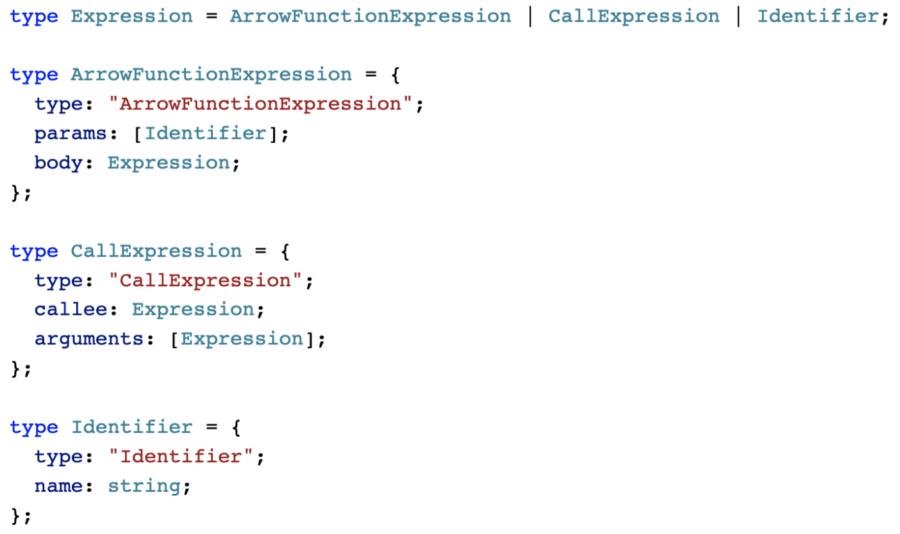
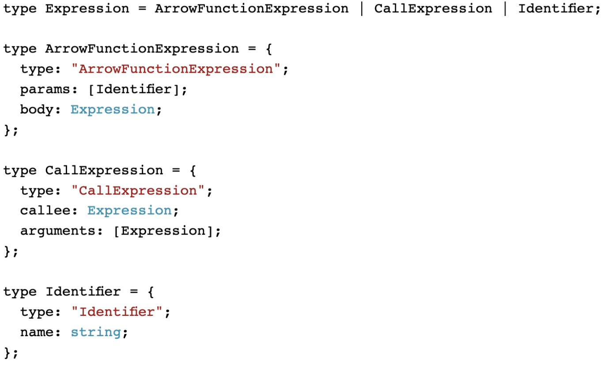

<div align="center">
<h1>Shiki LaTeX</h1>
<p><strong>A <a href="https://shiki.matsu.io">Shiki</a> renderer for <a href="https://www.latex-project.org">LaTeX</a>. Compatible with <a href="https://github.com/gpoore/minted">minted</a>, replacing <a href="https://pygments.org">Pygments</a>.</strong></p>
<p>
<a href="https://github.com/leafac/shiki-latex"></a>
<a href="https://www.npmjs.com/package/shiki-latex"></a>
<a href="https://github.com/leafac/shiki-latex/actions"></a>
</p>
</div>

# Comparison

| [Shiki](https://shiki.matsu.io)                      | [Pygments](https://pygments.org)                           |
| ---------------------------------------------------- | ---------------------------------------------------------- |
|  |  |

# Installation

Install [Node.js](https://nodejs.org/) and run:

```console
$ npm install shiki-latex
```

# Using with Minted

```latex
\usepackage{minted}
\renewcommand{\MintedPygmentize}{node_modules/.bin/shiki-minted}
```

## Themes

Choose a theme with the `\usemintedstyle{}` command.

You may refer to a built-in [Shiki theme](https://github.com/octref/shiki/tree/master/packages/themes) by name, for example:

```latex
\usemintedstyle{nord}
```

You may refer to a theme file that you download and put next to your LaTeX source (don’t put it under a folder because minted doesn’t support it); for example, to use the [SynthWave '84](https://github.com/robb0wen/synthwave-vscode) theme, download [`synthwave-color-theme.json`](https://github.com/robb0wen/synthwave-vscode/blob/master/themes/synthwave-color-theme.json) and add the following to your LaTeX source:

```latex
\usemintedstyle{synthwave-color-theme.json}
```

**Note:** Some themes may not look as good on a PDF as they do on a webpage. It’s part of the game: LaTeX renders things differently from a browser. It’s a hit-and-miss situation.

# Using Programmatically

```ts
import { getHighlighter } from "shiki";
import { renderToLaTeX } from "shiki-latex";

(async () => {
  const highlighter = await getHighlighter({ theme: "light_plus" });
  const lines = highlighter.codeToThemedTokens(
    `const name = "Leandro Facchinetti";`,
    "ts"
  );
  console.log(renderToLaTeX(lines));
})();
```

The package comes with type definitions for [TypeScript](https://www.typescriptlang.org).
